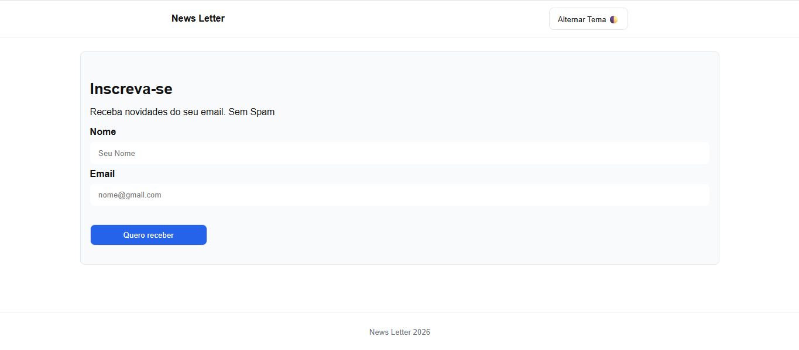
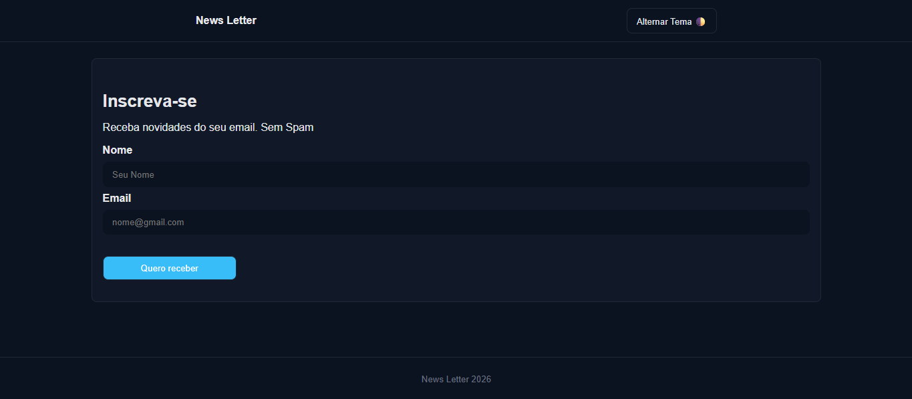

# Newsletter com Tema Claro/Escuro

Projeto de uma página de inscrição em uma newsletter com alternância de tema (light/dark mode), desenvolvido para praticar HTML, CSS e JavaScript.

## Preview do projeto

### Tema Claro

### Tema Escuro

## Tecnologias Utilizadas

- HTML
- CSS
- JavaScript

## Funcionalidades

- Alternância entre tema claro e escuro
- Formulário de inscrição (nome e email)
- Interface reponsiva e moderna

## Objetivo do projeto

Praticar manipulação do DOM, eventos em JavaScript e estilização com temas dinâmicos.

## Autor

Luis Francisco 